# Demonstration-project-splunk-group2


### Bharat Reddy Male


Sub topic 

  1. System performance using splunk.
  2. Search operations.
-
-
-
-
-
-
-
-

### Bhavya Deepthi Gorrepati


Sub Topics

 1. Create Dashboards.
 2. Analysing Reports.
  
## Prerequisites
First step required to work on Splunk is to download the free trial version of splunk software on the local machine depending on the type of OS. I am using Windows 64 bit. And also there are two types of splunk software based on licencing called as " Splunk Cloud" and " Splunk Enterprise". I worked on Splunk Enterprise as its licence lasts for 60 days. So this can be downloaded from [Splunk Website](https://www.splunk.com/).

Another basic necessity is to have the data required to perform the demo. The data can be found at [Data files](https://github.com/bharat-reddy-male/Demonstration-project-splunk-group2/tree/main/Bhavya).

## Process

### Step by Step Process
1. Install the Splunk Enterprise after downloading.
2. Launch Splunk Web
3. Navigate to splunk web(Home Page)
4. Upload the data(Data is related to Online Store Buttercup games )
5. Search the Data required in the search bar
6. Generate Report
7. Add the reports to the Dashboard

### Analyze the Reports
The basic idea is when we search the data, it can be saved in the form of reports for further reference. So, my data is related to the logs of buttercup games store which has information like client Ip addresses, product id's, timestamp, URL, URI, category of products, product actions etc.
1. Launch Screen with Search App and Menu Bar
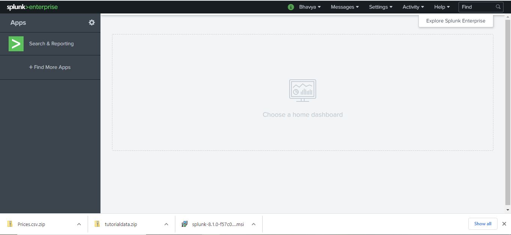
2. Search Bar Screen
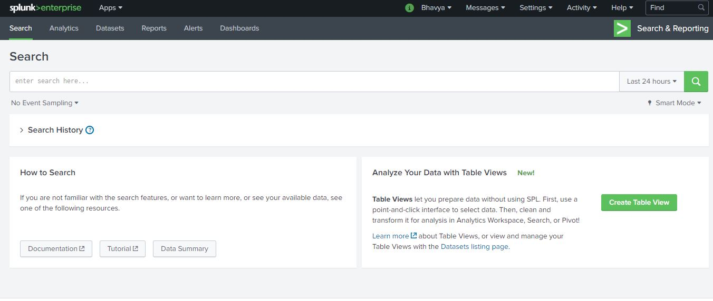
3. Seach query with Results in Statistics
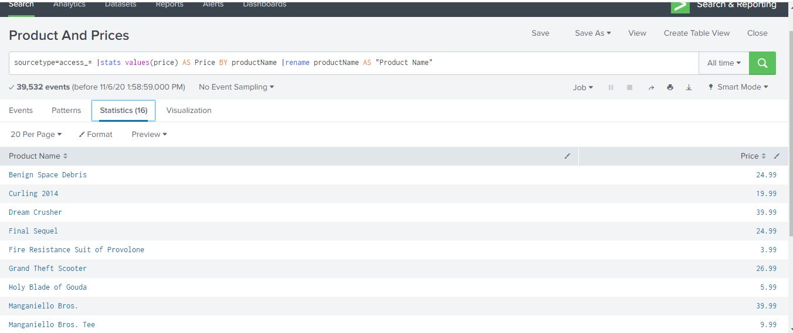
4. Results in Visualization format
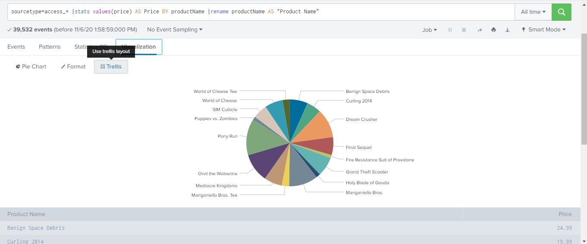
5. List of Reports
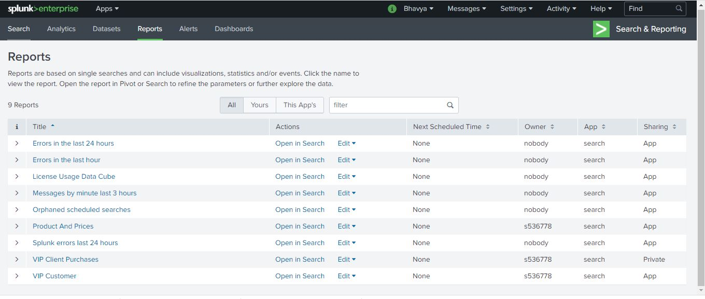

### Create Dashboards


## References
The following link [External Link](https://docs.splunk.com/Documentation/Splunk/latest/SearchTutorial/WelcometotheSearchTutorial) is the only reference I utilized to learn and perform the demo.


### Priyanka Bodapati


### Dataset Creation
1. The first screen apperas after opening the splunk is provided below.
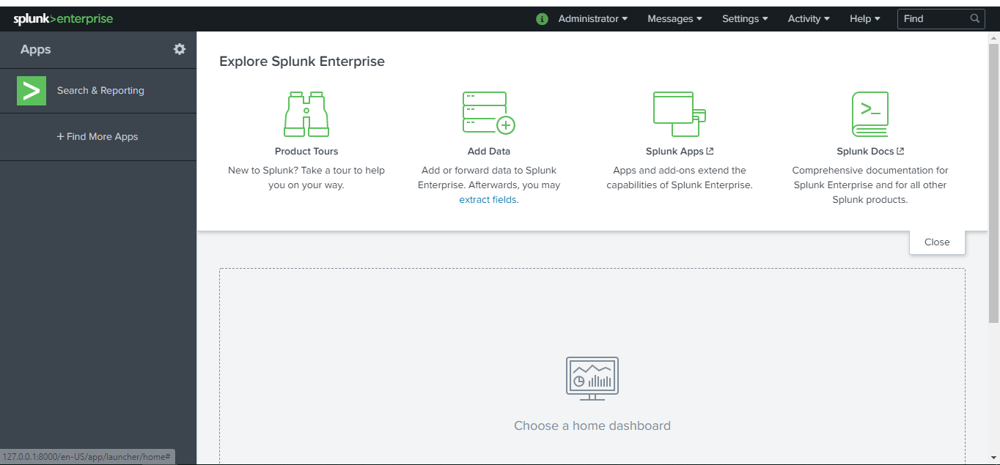
2. Click on "Search & Reporting". Where you can see all options
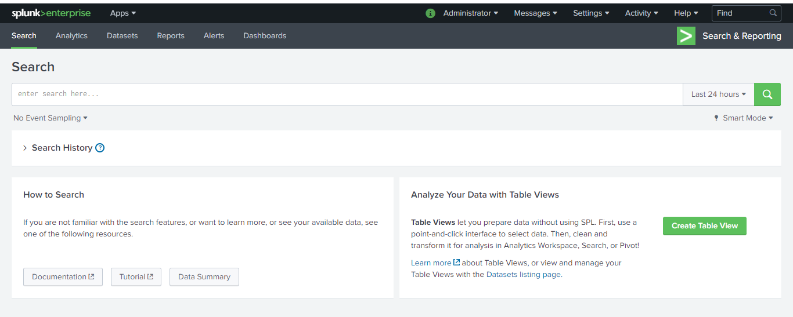
3. You can see Create Table view on right hand side top corner When you click on the datset on header as shown below.

4. You can see the index view in left handed side. You can select single or multiple indexes.
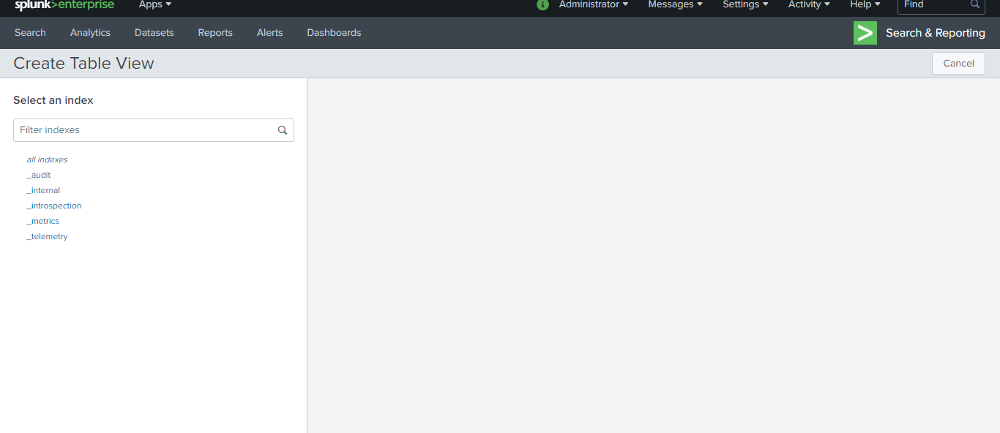
5. You can see the source types of indexes selected in above step. You can select single or multiple sources.
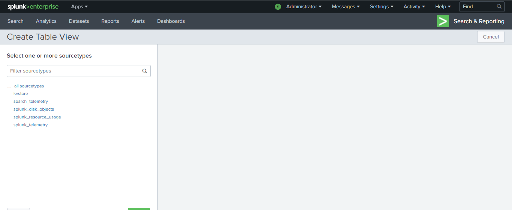
6. You can see the fields for corresponding sources. You can see the values when you keep curson on the fields.
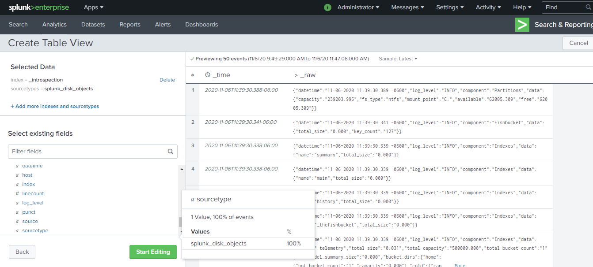
7. Select the fileds. Field names and details will appear and click on start editing.
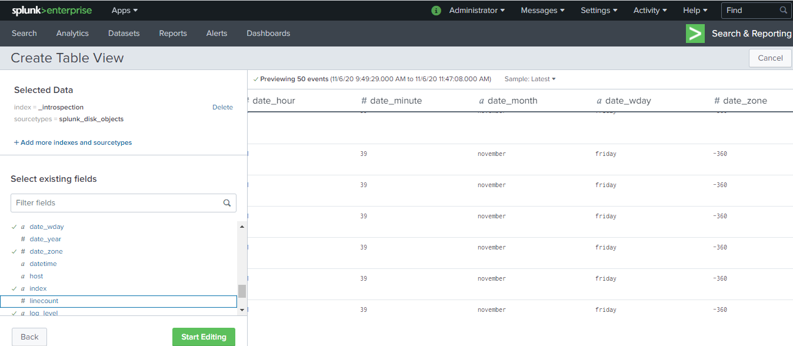
8. You can see the full table view and with some options Edit, sort, filter, summarize.
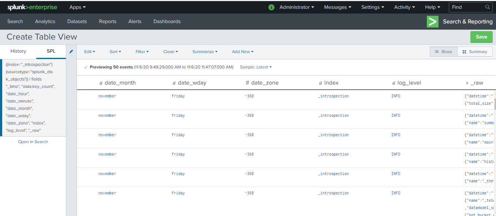
9. Click on the summarize. You can see the full details of Table
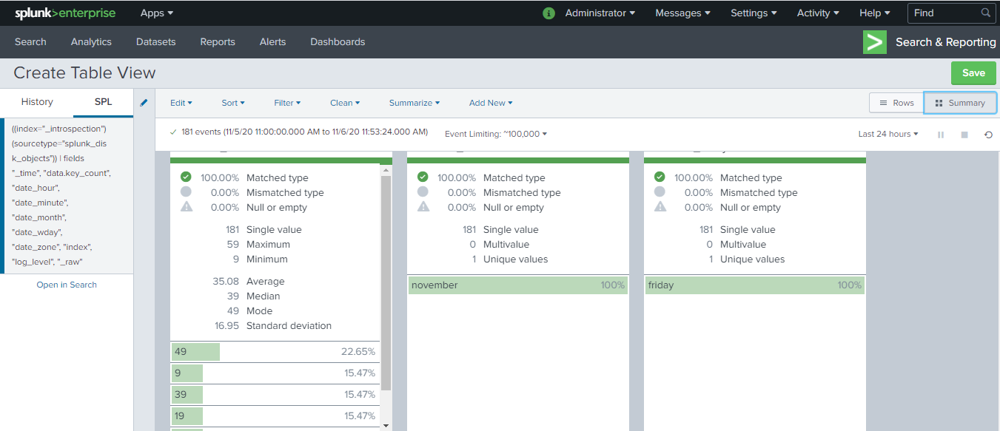

### Chetan Kudaravalli


Sub Topics
1. Transforming commands
-
-
-
-
-
-
-
-
-
-
### Chinmayi Ambati

-
## Sub Topics
1. Introduction to Splunk interface
-
## Prerequisites to start working with Splunk
1. Log in to the [splunk website](https://www.splunk.com/)
2. Head to https://www.splunk.com/en_us/download/splunk-enterprise.html. This will download the splunk enterprise into your local system
3. Finish the installation process and log in to the splunk enterprise using the credentials provided during installation

## Process

### To inject data

1. Once you are logged in as an administrator, you are taken to the home page. Click on the "Add Data" icon.
2. From the add data page, click on the upload button
3. You will be taken to the Select Source step. Click the Select File button and choose the access_30Day.log file that you downloaded earlier (from the sample data).


4. Once the file is uploaded, click the Next button.
5. On the Set Source Type step, you will see that Splunk automatically set the source type correctly as access_combined_wcookie. 
   


6. Click the Next button. 
7. From the Input Settings step, enter web_application as the Host field value and click the Review button.


8. You will be taken to the Review step. Make sure your settings match what is shown below and click "Submit".


9. Splunk will process the file. When completed, a dialog will appear telling you the file has been successfully uploaded.

### To Search data

1. Login as a power user using the default credentials added at the time of installation.
2. Navigate to the search view and in the search bar, type the search: error OR fail*. Make sure to choose the time range to be all time.
3. Notice at the bottom of each event we see values for host, source and scourcetype.
4. Look at the host values to see we are getting events for both our web_application and web_server hosts.


5. Click one of the user names in the search results. Note that when you click a user name, a menu of options appears:


6. Click add to search.
7. Look at the timeline to see if there are any spikes in password failures for this user.

### To use fields

1. Go to the search bar and search for ``` index=main sourcetype=access_combined_wcookie action=purchase ``` for All time.
2. This returns all events where a purchase action was taken.
3. Examine the fields towards left of the events


4. Select on any field and add it to your search bar to make the searching more efficient.

### References: 

Subtopics found at  -->[Splunk - Demo](https://www.splunk.com/en_us/resources/videos/splunk-web-demo.html)
