# Demonstration-project-splunk-group2


### Bharat Reddy Male


Sub topic 

  1. System performance using splunk.
  2. Search operations.

  #### Pre-requisites:

  1. This is a windows based demo and requires splunk tool to be installed on you local windows machine. 

  2. Getting the tutorial data - The data is availabe at in the *Download the tutorial data files* section at [https://docs.splunk.com/Documentation/Splunk/8.1.0/SearchTutorial/Systemrequirements](https://docs.splunk.com/Documentation/Splunk/8.1.0/SearchTutorial/Systemrequirements)
  
  #### System performance using splunk:

  Splunk helps us to monitor multiple servers at a time to manage complex data like

  1. Events
  2. Errors
  3. Application logs 
  4. Security logs
  5. CPU performance
  6. Memory Usage and many more..

  Now lets get started with how to setup a local system in splunk for monitoring.

  ##### Steps: 
  1. Login to the splunk application and navigate to the ```Data Inputs``` link in the settings section.
  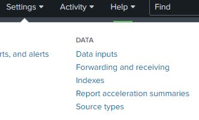

  2. Select the *Files and Directories* as the type.
  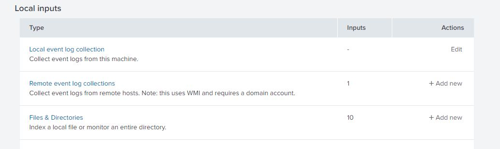

  3. Create a new Local File and Directory and select *Local windows host monitoring* in the left pane fill the required fields.
  ```Collection name: Provide a unique name,```
  ```Event Types: Select the event types you want to monitor,```
  ```Interval: Time in seconds```
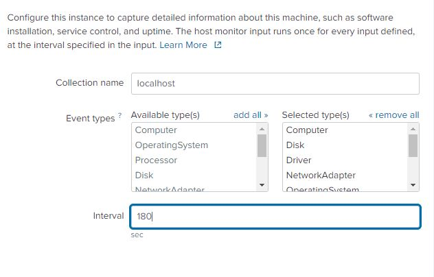

4. Select the app context based on the task you are performing. 

5. Review and submit. Once done you will be provided with this screen on success.
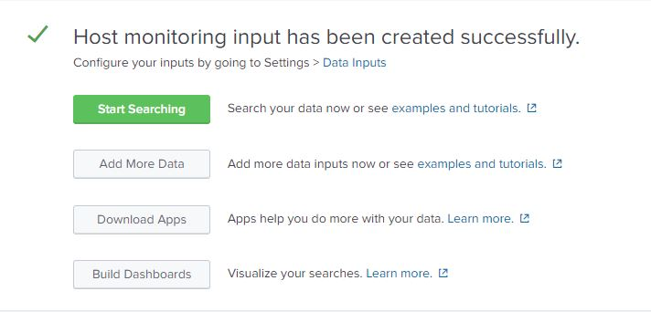

##### Viewing our logs 

- Raw format:

  Click on the start searching button and the app takes you to search window where you can run queries on the data.

  A sample query for getting the all the data is given below.

  ```source="localhost" host="nw42694" sourcetype="WinHostMon"```

  This query can be run on multiple time stamps like data within a week, day, hour etc.

  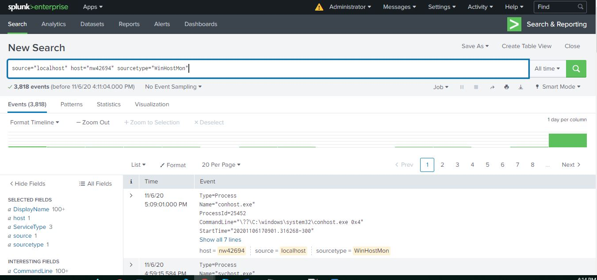

- Dashboard of the system:

    Splunk provides a pre built dashboard for the system performance monitoring. This is availabe in the home screen of the application.
    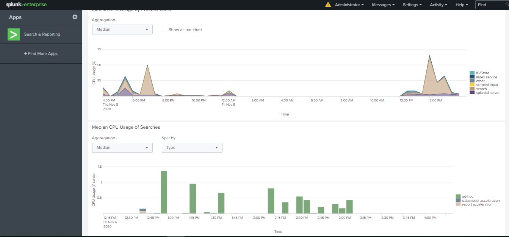
    

#### Search Operations:

Firstly lets add some data into splunk for performing search operations. 

The data which splunk provided earlier in this tutorial. To add the data into splunk,
1. Go to the add data link and select upload files.
2. Select the tutorials.zip file from the file explorer and click next.

3. In the next window, select the host option to *Regular expression on path* and give the regular expression as ```\\(.*)\/```. 

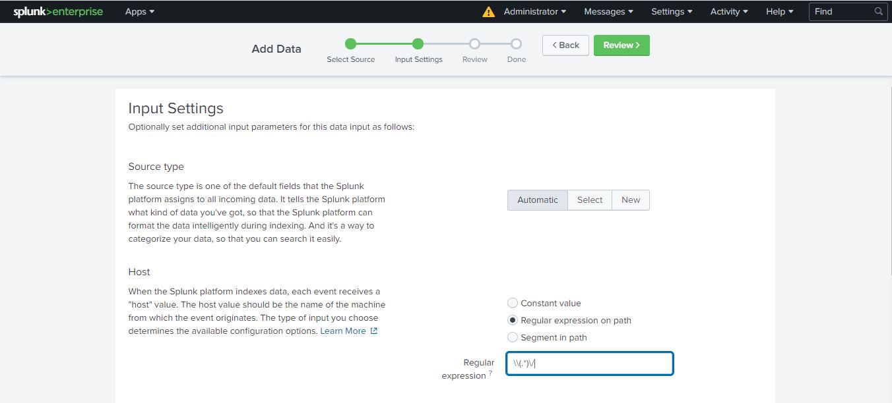

4. Review and submit.

Once the file is uploaded, Navigate to the home page and click on *Search & Reporting*

##### Searching using the search tab

Lets search for the logs with buttercutgames that failed. To do so enter the below query in the search field and select a timestamp of your wish and click on search icon.

```buttercupgames (error OR fail* OR severe)```

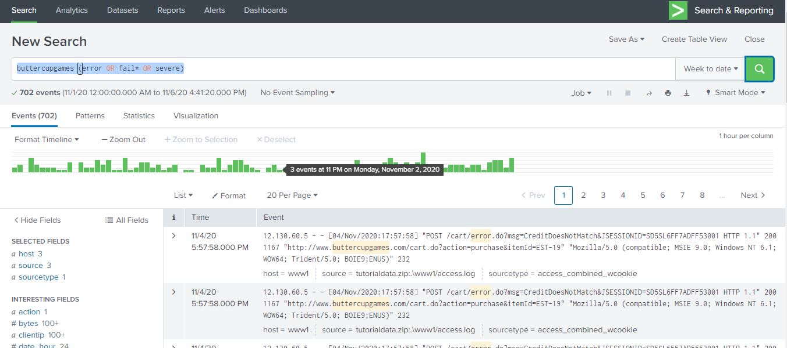

Now lets try to visualize some data from the same dataset with a different query. Enter the query below and select a timestamp of your wish and click on search.

```sourcetype=access_* status=200 action=purchase | top categoryId```

Go to the visualization tab and select a visual format or your wish. A pie chart and a bar graph of the result is given below.
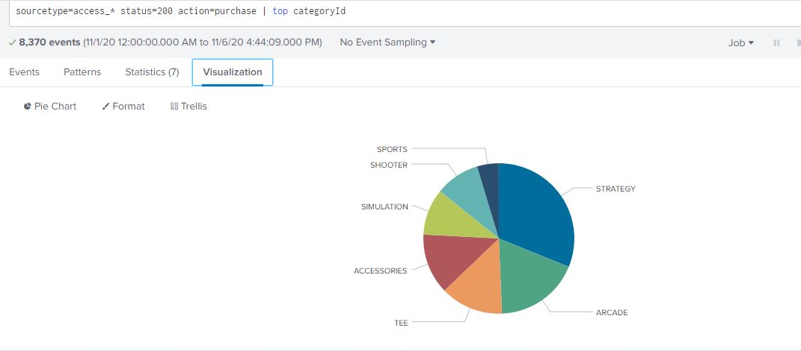
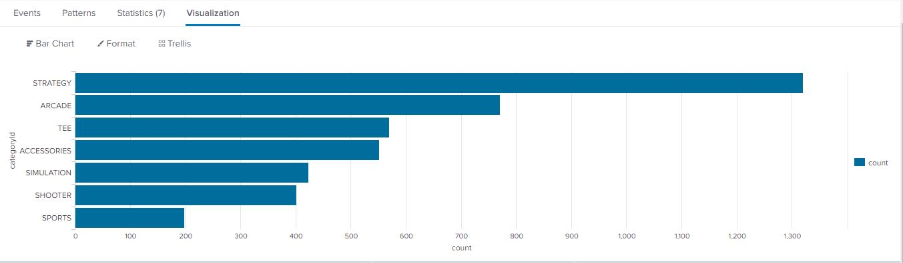

This way you can perform search operations on your data and visualize it as per your needs for a better understanding.  

##### Demo Video:
A video with step by step procedure of this section is availabe at [https://youtu.be/w6UV-Ms0QKY](https://youtu.be/w6UV-Ms0QKY)

##### References:

1. Download splunk -> [https://www.splunk.com/](https://www.splunk.com/)
2. Data used in this section -> [https://docs.splunk.com/Documentation/Splunk/8.1.0/SearchTutorial/Systemrequirements](https://docs.splunk.com/Documentation/Splunk/8.1.0/SearchTutorial/Systemrequirements)


### Bhavya Deepthi Gorrepati


Sub Topics

 1. Create Dashboards.
 2. Analyzing Reports.
  
## Prerequisites
First step required to work on Splunk is to download the free trial version of splunk software on the local machine depending on the type of OS. I am using Windows 64 bit. And also there are two types of splunk software based on licensing called as " Splunk Cloud" and " Splunk Enterprise". I worked on Splunk Enterprise as its license lasts for 60 days. So this can be downloaded from [Splunk Website](https://www.splunk.com/).

Another basic necessity is to have the data required to perform the demo. The data can be found at [Data files](https://github.com/bharat-reddy-male/Demonstration-project-splunk-group2/tree/main/Bhavya).

## Process

### Step by Step Process
1. Install the Splunk Enterprise after downloading.
2. Launch Splunk Web
3. Navigate to splunk web(Home Page)
4. Upload the data(Data is related to Online Store Buttercup games )
5. Search the Data required in the search bar
6. Generate Report
7. Add the reports to the Dashboard

### Analyze the Reports
The basic idea is when we search the data, it can be saved in the form of reports for further reference. So, my data is related to the logs of buttercup games store which has information like client Ip addresses, product id's, timestamp, URL, URI, category of products, product actions etc.
1. Launch Screen with Search App and Menu Bar

2. Search Bar Screen

3. Search query with Results in Statistics

4. Results in Visualization format

5. List of Reports


#### Commands Used to create the reports:
1. In the command ```sourcetype=access_* |stats values(price) AS Price BY productName |rename productName AS "Product Name"``` source type specifies which type of file to access for searching, Pipe character(|) takes the result of left value as input to the right value, stats is a transform command that displays output in statistics and visualization format, AS is used as alias, rename is used to rename the column names. On a whole the above command displays the list of product names and prices in the input data file.

2. Other command used for practice is 
```sourcetype=access_* status=200 action=purchase [search sourcetype=access_* status=200 action=purchase | top limit=1 clientip | table clientip] | stats count AS "Total Purchased", dc(productId) AS "Total Products", values(productId) AS "Product IDs" BY clientip | rename clientip AS "VIP Customer"```. This command utilizes the sub search process using []. This command displays the VIP Customer Ip address along with count of purchases made, count of different products bought and product Id's.


### Create Dashboards
Dashboards are views that are made up of panels. The panels can contain modules such as search boxes, fields, charts, tables, and lists. Dashboard panels are usually connected to reports.
After creating a search visualization or saving a report, we can add it to a new or existing dashboard. There is also a Dashboard Editor that we can use to create and edit dashboards. The Dashboard Editor is useful when we have a set of saved reports that we want to quickly add to a dashboard.
1. Click on the Dashboard menu in the Home Page and Create a New Dashboard by clicking on the create button by providing a title and description.
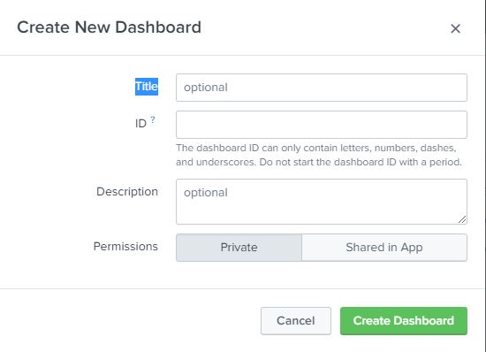
2. In the Edit button click on Edit Panel option from the menu
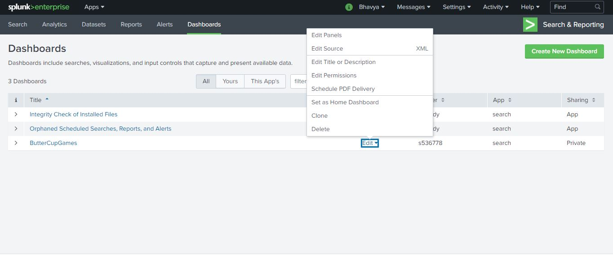
3. Click on Add Panel option and select the panel from already generated reports.
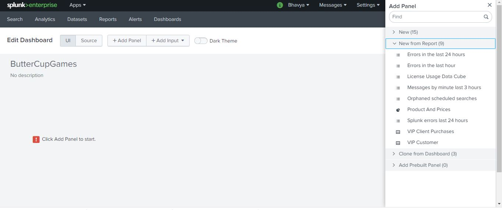
4. After adding the panel, the screen looks like below.
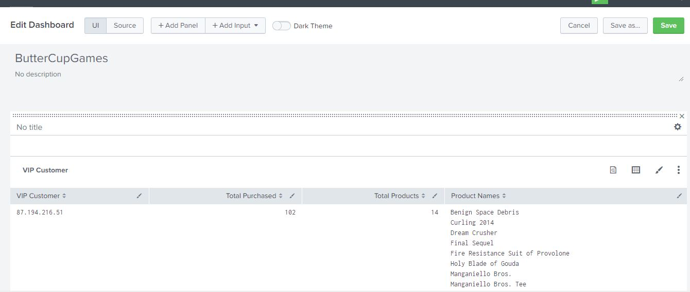
5. Click on save to save the panel to the Dashboard.
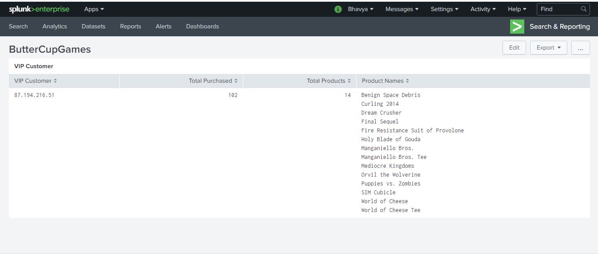

Another way to add panel is while searching and saving immediately like below.
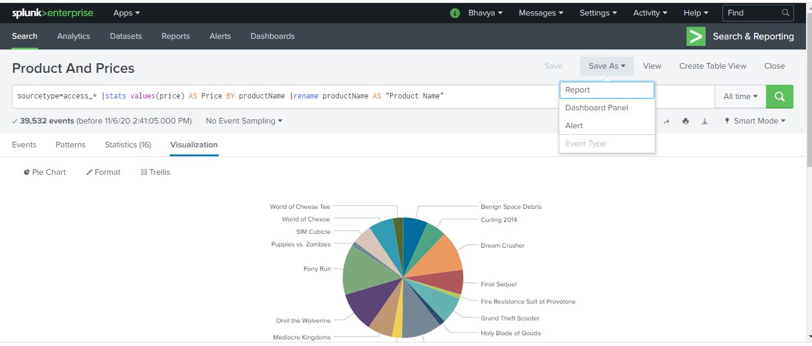

#### Command: 
```sourcetype=access_* status=200 action=purchase | top categoryId``` is the search command used to search and add the result as a dashboard panel. Here this command searches the source type as access files, with status as 200 called 'Success' and action type as purchase with item categories purchased at most.

## Demo: 
The following is the link for the  demo Video [Demo](Bhavya/SplunkDemo_Bhavya.mp4)

## References
The following link [External Link](https://docs.splunk.com/Documentation/Splunk/latest/SearchTutorial/WelcometotheSearchTutorial) is the only reference I utilized to learn and perform the demo.


### Priyanka Bodapati


### Dataset Creation
1. The first screen apperas after opening the splunk is provided below.

2. Click on "Search & Reporting". Where you can see all options

3. You can see Create Table view on right hand side top corner When you click on the datset on header as shown below.

4. You can see the index view in left handed side. You can select single or multiple indexes.

5. You can see the source types of indexes selected in above step. You can select single or multiple sources.

6. You can see the fields for corresponding sources. You can see the values when you keep curson on the fields.

7. Select the fileds. Field names and details will appear and click on start editing.

8. You can see the full table view and with some options Edit, sort, filter, summarize.

9. Click on the summarize. You can see the full details of Table


#### References
1. You can download Splunk at https://www.splunk.com/en_us/download/splunk-enterprise.html
2. Followed the video for creation of datasets https://www.youtube.com/watch?v=vTMn4nkAWYo&t=568s&ab_channel=unofficialsplunk
3. Splunk Demo which is provided at the end

### Chetan Kudaravalli


## Sub Topic
### Transforming commands

## Prerequisites
* Log in to the [splunk website](https://www.splunk.com/) and then to https://www.splunk.com/en_us/download/splunk-enterprise.html to download the splunk enterprise and then log in to the splunk enterprise using the credentials provided during installation.

## Process

1. when you are logged in as an administrator, you are taken to the home page shown as below</br>


2. when you go click on search and reporting, you will get a search bar for using transforming commands.</br>


## Commands

1.Command for system administrator to get internal data in splunk server.</br>
``` index="_internal" sourcetype=splunkd ```</br>
</br>
2. command for Chart transforming command</br>
``` index="_internal" sourcetype=splunkd | chart count by max_size_kb ``` and below is the screenshot for visualization of data.</br>
</br>
3. command for timechart transforming command ``` index="_internal" sourcetype=splunkd | timechart count by max_size_kb ```</br>
4. Command for stats transforming command </br>``` index="_internal" sourcetype=splunkd | stats count ``` and below is the screenshot for visualization of data.</br>

* Command for rare transforming command``` index="_internal" sourcetype=splunkd | rare max_size_kb ```</br>
* Command for top transforming command``` index="_internal" sourcetype=splunkd | top max_size_kb ```

## Demo
* [Demo Link](https://use.vg/aa0zEo)

## References
* [splunk Demo](https://docs.splunk.com/Splexicon:Transformingcommand)
* [Transforming commands](https://www.youtube.com/watch?v=wR_FdzfoFFA)


### Chinmayi Ambati

-
## Sub Topics
1. Introduction to Splunk interface
-
## Prerequisites to start working with Splunk
1. Log in to the [splunk website](https://www.splunk.com/)
2. Head to https://www.splunk.com/en_us/download/splunk-enterprise.html. This will download the splunk enterprise into your local system
3. Finish the installation process and log in to the splunk enterprise using the credentials provided during installation

## Process

### To inject data

1. Once you are logged in as an administrator, you are taken to the home page. Click on the "Add Data" icon.
2. From the add data page, click on the upload button
3. You will be taken to the Select Source step. Click the Select File button and choose the access_30Day.log file that you downloaded earlier (from the sample data).


4. Once the file is uploaded, click the Next button.
5. On the Set Source Type step, you will see that Splunk automatically set the source type correctly as access_combined_wcookie. 
   


6. Click the Next button. 
7. From the Input Settings step, enter web_application as the Host field value and click the Review button.


8. You will be taken to the Review step. Make sure your settings match what is shown below and click "Submit".


9. Splunk will process the file. When completed, a dialog will appear telling you the file has been successfully uploaded.

### To Search data

1. Login as a power user using the default credentials added at the time of installation.
2. Navigate to the search view and in the search bar, type the search: error OR fail*. Make sure to choose the time range to be all time.
3. Notice at the bottom of each event we see values for host, source and scourcetype.
4. Look at the host values to see we are getting events for both our web_application and web_server hosts.


5. Click one of the user names in the search results. Note that when you click a user name, a menu of options appears:


6. Click add to search.
7. Look at the timeline to see if there are any spikes in password failures for this user.

### To use fields

1. Go to the search bar and search for ``` index=main sourcetype=access_combined_wcookie action=purchase ``` for All time.
2. This returns all events where a purchase action was taken.
3. Examine the fields towards left of the events


4. Select on any field and add it to your search bar to make the searching more efficient.

### References: 

Subtopics found at  -->[Splunk - Demo](https://www.splunk.com/en_us/resources/videos/splunk-web-demo.html)
