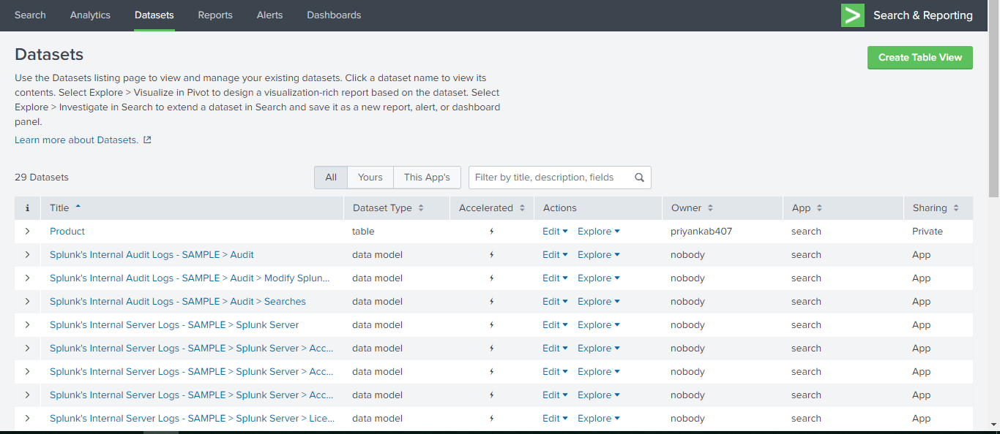

# Demonstration-project-splunk-group2

### Bharat Reddy Male

Sub topic 

  1. System performance using splunk.
  2. Search operations.
-
-
-
-
-
-
-
-

### Bhavya Deepthi Gorrepati

Sub Topics

 1. Create Dashboards.
 2. Analysing Reports.
  
-
-
-
-
-
-
-
-
-

### Priyanka Bodapati

### Dataset Creation
1. The first screen apperas after opening the splunk is provided below.

2. Click on "Search & Reporting". Where you can see all options

3. You can see Create Table view on right hand side top corner When you click on the datset on header as shown below.

4. You can see the index view in left handed side. You can select multiple indexes.

### Chetan Kudaravalli

Sub Topics
1. Transforming commands
-
-
-
-
-
-
-
-
-
-
### Chinmayi Ambati

-
Sub Topics
1. Introduction to Splunk interface
-
-
-
-
-
-

### References: 

Subtopics found at  -->[Splunk - Demo](https://www.splunk.com/en_us/resources/videos/splunk-web-demo.html)
